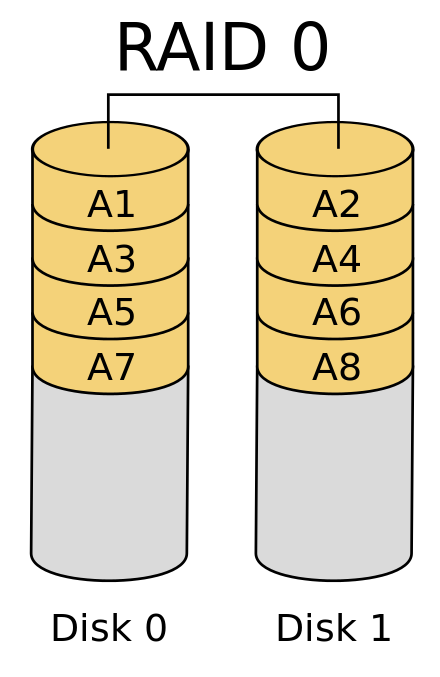
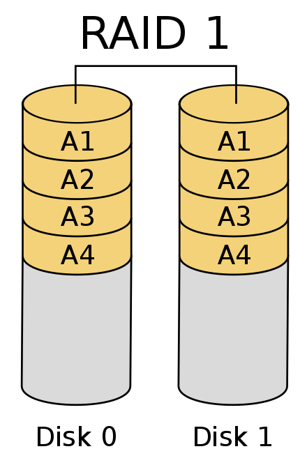

RAID
###########

.. panels::

    **RAID 0**

    ``Striping``

    .. image:: ../raid0.png
       :alt: some image
       :class: with-shadow
       :scale: 25

    ---

    **RAID 1**

    ``Mirroring``

    .. image:: ../raid1.png
       :alt: some image
       :class: with-shadow
       :scale: 25

    ---

    **RAID 5**

    ``Block-Level Striping``

    .. image:: ../raid5.png
       :alt: some image
       :class: with-shadow
       :scale: 50

.. admonition:: Was ist ein RAID?

  Ein ``RAID-System`` dient zur Organisation mehrerer physischer
  Massenspeicher zu **einem** logischen Laufwerk,
  das eine **höhere Ausfallsicherheit** oder einen **größeren Datendurchsatz** erlaubt als
  ein einzelnes physisches Speichermedium.

RAID 0: Striping
****************

Bei RAID 0 fehlt die Redundanz,
daher gehört es streng genommen
nicht zu den RAID-Systemen,
es ist nur ein schnelles **„Array of Independent Disks“**.

**RAID 0 bietet gesteigerte Transferraten, indem die beteiligten Festplatten in zusammenhängende
Blöcke gleicher Größe aufgeteilt werden, wobei diese Blöcke quasi im Reißverschlussverfahren zu einer großen Festplatte angeordnet werden. Somit können Zugriffe auf allen Platten parallel durchgeführt werden**

subtext

:badge:`Vorteile,badge-success`
===============================

 - gesteigerte Transferraten

:badge:`Nachteile,badge-danger`
===============================

 - bei Defekt einer Platte tritt Datenverlust ein

RAID 1: Mirroring - Spiegelung
********************************

**RAID 1 ist der Verbund von mindestens zwei Festplatten.
Beide Platten sind identisch beschrieben und enthalten alle Daten eines Systems.**

:badge:`Vorteile,badge-success`
===============================

- Fällt eine der gespiegelten Platten aus, kann jede andere weiterhin alle Daten liefern
- Zur Erhöhung der Leseleistung kann ein RAID-1-System beim Lesen auf mehr als eine Festplatte zugreifen und gleichzeitig verschiedene Sektoren von verschiedenen Platten einlesen

:badge:`Nachteile,badge-danger`
===============================

- Eine Spiegelplatte ist kein Ersatz für eine Datensicherung

RAID 5: Leistung + Parität
********************************

.. image:: ../raid5.png
   :alt: some image
   :class: with-shadow
   :scale: 50

**Block-Level Striping mit verteilter Paritätsinformation.
Die Nutzdaten von RAID-5-Gruppen werden wie bei RAID 0 auf alle Festplatten verteilt.
Gegensatz zum RAID-Level 1 findet keine Spiegelung der Daten statt, sondern verlorene Daten lassen sich aus den Paritätsinformationen herstellen.**
Aus dem Verbund kann eine Festplatte vollständig ausfallen, ohne dass dadurch Daten verloren gehen. Typischerweise ist die Anzahl der Festplatten in einem RAID-5-Verbund ungerade und beträgt **drei, fünf oder mehr Festplatten.**

:badge:`Vorteile,badge-success`
===============================

- RAID 5 bietet sowohl **gesteigerten Datendurchsatz** beim Lesen von Daten als auch Redundanz bei relativ geringen Kosten und ist dadurch eine sehr beliebte RAID-Variante.

:badge:`Nachteile,badge-danger`
===============================

- Nachteil im Vergleich zu anderen RAID-Leveln ist, dass Schreibvorgänge durch das Lesen und Berechnen von Paritätsdaten **langsamer** sind

.. warning::
 - Mehr Infos  : https://de.wikipedia.org/wiki/RAID